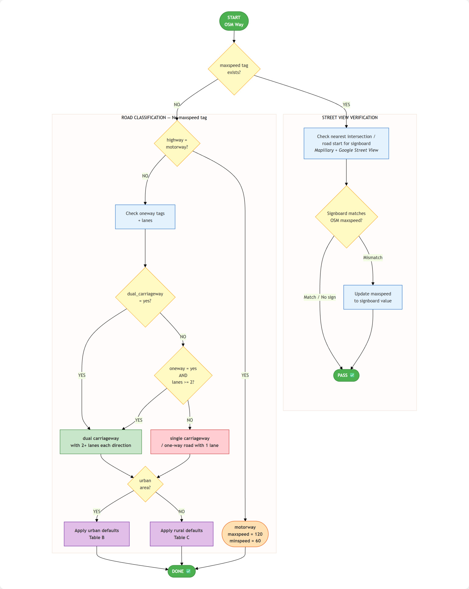

# Bộ Wiki Luật Internal

> **Q-1** · Nguồn: `internal_wiki_update_osm_v0.1.pdf` (v0.1) · Transcribe sang Markdown để cập nhật & publish Confluence.

**Mục tiêu:** Ánh xạ luật giao thông VN (**Thông tư 38/2024/TT-BGTVT**) sang các loại đường thực tế trên OpenStreetMap.

**Nguyên tắc chính:** *map theo **hình thái đường**, KHÔNG thuần theo highway class.*

**Scope:** Phân biệt trong/ngoài khu đô thị, dải phân cách cứng, số làn, oneway, xe máy vs ô tô.

---

## 1.1 Ánh xạ Điều khoản → Quy định tốc độ

Thông tư 38/2024/TT-BGTVT có 6 điều liên quan đến tốc độ:

**Bảng 1.1 — Ánh xạ Điều khoản Thông tư 38/2024 → OSM**

| Điều | Nội dung | Quy định tốc độ | Ghi chú OSM |
|---|---|---|---|
| **Điều 6** | Tốc độ tối đa trong khu vực đông dân cư | Đường đôi / 1 chiều ≥2 làn: **60 km/h** Đường 2 chiều / 1 chiều 1 làn: **50 km/h** | Áp dụng khi zone = urban. Không phân biệt loại xe |
| **Điều 7** | Tốc độ tối đa ngoài khu vực đông dân cư | Phân biệt theo loại đường **VÀ** loại xe (xem bảng chi tiết bên dưới) | Áp dụng khi zone = rural. 6 nhóm xe khác nhau |
| **Điều 8** | Tốc độ trên đường cao tốc | maxspeed theo biển báo trên từng đoạn. Tối đa 120, tối thiểu 60 | `highway=motorway` Ưu tiên giá trị biển báo |
| **Điều 9** | Xe cơ giới đặc biệt | Xe máy chuyên dùng: 40 4 bánh chở khách: 30 4 bánh chở hàng: 50 | Không map trên OSM (quá đặc thù) |
| **Điều 10–11** | Khoảng cách an toàn | V=60→35m, 60-80→55m 80-100→70m, 100-120→100m | Tham khảo, không tag trên OSM |

---

## 1.2 Hình thái đường → OSM Tag

**Nguyên tắc quan trọng nhất:** Luật VN phân loại đường theo **hình thái vật lý** (có dải phân cách cứng hay không, bao nhiêu làn), **KHÔNG** theo cấp đường (highway class). Một đường `highway=primary` có dải phân cách cứng sẽ có tốc độ khác với `highway=primary` không có dải phân cách.

**Bảng 1.2 — Hình thái đường → Tag OSM** (Nguyên tắc: map theo hình thái, KHÔNG theo highway class)

| Loại đường (VN) | Đặc điểm thực tế | OSM Detection | Ghi chú |
|---|---|---|---|
| **Đường cao tốc** (Motorway) | Đường dành riêng cho xe cơ giới, có dải phân cách, nút giao khác mức | `highway=motorway` `highway=motorway_link` | Luôn kiểm tra biển báo. Điều 8 |
| **Đường đôi có dải phân cách cứng** (Dual carriageway) | Có dải phân cách giữa (median) vật lý, mỗi chiều ≥1 làn | `dual_carriageway=yes` | KHÔNG dùng highway class. Map theo hình thái thực tế |
| **Đường 1 chiều ≥ 2 làn** (One-way ≥2 lanes) | Xe chỉ đi 1 chiều, có từ 2 làn xe cơ giới trở lên | `oneway=yes` AND `lanes ≥ 2` | Cùng nhóm tốc độ với đường đôi (Điều 6-7) |
| **Đường 2 chiều** (Two-way / Single) | Xe đi 2 chiều, không có dải phân cách cứng | Không có `dual_carriageway` Không có `oneway=yes` | Nhóm tốc độ thấp hơn |
| **Đường 1 chiều 1 làn** (One-way 1 lane) | Xe chỉ đi 1 chiều, chỉ có 1 làn xe cơ giới | `oneway=yes` AND `lanes=1` (hoặc lanes không ghi) | Cùng nhóm tốc độ với đường 2 chiều |

---

## 1.3 Phân biệt: Trong / Ngoài khu vực đông dân cư

Đây là yếu tố quyết định thứ hai sau hình thái đường. Trong khu đô thị, tất cả xe đều cùng tốc độ (60 hoặc 50). Ngoài khu đô thị, tốc độ phụ thuộc thêm loại xe.

**Bảng 1.3 — Phân biệt: Trong / Ngoài khu vực đông dân cư**

| Khu vực | Đặc điểm nhận biết | Cách xác định trên OSM |
|---|---|---|
| **Trong khu vực đông dân cư (Urban)** | Có biển báo "Bắt đầu khu đông dân cư" (biển R.420), nhà cửa san sát, có vỉa hè, đèn đường, ngã tư có đèn tín hiệu | `landuse=residential` gần way, `place=city/town/village` boundary bao quanh, hoặc đánh giá từ Street View |
| **Ngoài khu vực đông dân cư (Rural)** | Không có biển báo khu đông dân cư, đường liên xã/liên huyện, ít nhà cửa, không có vỉa hè liên tục | Không có `landuse=residential`, không nằm trong place boundary, hoặc đánh giá từ Street View |

---

## 1.4 Phân loại xe: Luật VN → OSM Tag

**Lưu ý cho team:** Quân thị bằng ô tô nên nắm rõ bảng quy định này. Ngoài khu đô thị, **6 nhóm xe có tốc độ khác nhau**. Trong khu đô thị, mọi xe đều bằng nhau.

**Bảng 1.4 — Phân loại xe: Luật VN → OSM Tag (6 nhóm xe)**

| Loại xe (Luật VN) | OSM vehicle type | OSM Tag | Rural (đôi / đơn) | Urban (đôi / đơn) |
|---|---|---|---|---|
| Ô tô con, xe tải ≤3.5t, xe khách ≤28 chỗ | motorcar (default) | `maxspeed` *(có thể impact đến 2W nếu thiếu tag cho 2W)* | 90 / 80 | 60 / 50 |
| Xe khách >28 chỗ | coach | `maxspeed:coach` | 80 / 70 | 60 / 50 |
| Xe tải >3.5t | goods >3.5t | `maxspeed:goods:conditional` | 80 / 70 | 60 / 50 |
| Xe buýt | bus | `maxspeed:bus` | 70 / 60 | 60 / 50 |
| Xe ô tô con | car | `maxspeed:motorcar` | 90 / 80 | 60 / 50 |
| Mô tô (xe máy) | motorcycle | `maxspeed:motorcycle` | 70 / 60 | 60 / 50 |
| Xe kéo rơ moóc | trailer | `maxspeed:conditional @ (trailer)` | 60 / 50 | 60 / 50 |

> **Lưu ý:** Format tốc độ: *đường đôi / đường đơn*. VD: 90/80 = 90 km/h trên đường đôi, 80 km/h trên đường đơn.
> **Lưu ý:** Trong khu đô thị (Urban): tốc độ **KHÔNG** phụ thuộc loại xe, chỉ phụ thuộc loại đường (60 hoặc 50).

---

## 1.5 Oneway: Xe máy vs Ô tô (2W – 4W)

Ở Việt Nam, nhiều đường 1 chiều cho ô tô nhưng **cho phép xe máy đi ngược chiều**. Khi đó, road category cho motorcycle ≠ road category cho motorcar:

- Xe máy đi 2 chiều → đường = "2 chiều" cho motorcycle → tốc độ thấp hơn
- Ô tô đi 1 chiều + ≥2 làn → đường = "đường đôi" cho motorcar → tốc độ cao hơn

**Bảng 1.5 — Oneway: Xe máy vs Ô tô — Ảnh hưởng đến road category**

| OSM Tag(s) | Xe máy (motorcycle) | Ô tô (motorcar) | Ý nghĩa cho speed limit |
|---|---|---|---|
| `oneway=yes` | Một chiều ↗ | Một chiều ↗ | Cùng chiều → cùng road category |
| `oneway:motorcar=yes` | Hai chiều ↔ | Một chiều ↗ | Xe máy đi 2 chiều → có thể khác category cho motorcycle |
| `oneway:motorcycle=yes` | Một chiều ↗ | Hai chiều ↔ | Ô tô đi 2 chiều → có thể khác category cho motorcar |
| `oneway=no` | Hai chiều ↔ | Hai chiều ↔ | Đường 2 chiều bình thường |
| `oneway=yes` + `oneway:motorcycle=no` | Hai chiều ↔ | Một chiều ↗ | Xe máy ngược chiều được phép → motorcycle: road = 2 chiều |
| `oneway=yes` + `oneway:motorcar=no` | Một chiều ↗ | Hai chiều ↔ | Ô tô ngược chiều được phép → motorcar: road = 2 chiều |
| `oneway=no` + `oneway:motorcar=yes` | Hai chiều ↔ | Một chiều ↗ | Chỉ ô tô 1 chiều |
| `oneway=no` + `oneway:motorcycle=yes` | Một chiều ↗ | Hai chiều ↔ | Chỉ xe máy 1 chiều |

> **Lưu ý:** Trường hợp xe máy và ô tô có oneway status khác nhau: phải đánh giá road category **RIÊNG** cho từng loại xe.

---

## 1.6 Sơ đồ tổng quan workflow

Flowchart bên dưới mô tả toàn bộ quy trình phân loại đường và áp dụng tốc độ mặc định:

---

*Tiếp theo → [02 · Bảng Quyết Định theo Luật](02-bang-quyet-dinh-theo-luat.md)*
