# Bảng Quyết Định — Đối chiếu luật cho đoạn không có ảnh

> **Q-2** · Nguồn: `internal_wiki_update_osm_v0.1.pdf` (v0.1) · Transcribe sang Markdown.

**Mục tiêu:** Với mỗi mẫu đường (segment), ghi rõ cơ sở chọn speed limit để cả team hiểu. **Đây là input cho decision tree của Tuệ.**

**Khi không có ảnh Street View:** dựa hoàn toàn vào OSM tags (`dual_carriageway`, `oneway`, `lanes`) + phân vùng urban/rural để tra bảng tốc độ theo luật.

---

## 2.1 Decision Matrix: Pattern → Speed Limit

**Bảng 2.1 — Decision Matrix: OSM Tags → Tốc độ + Cơ sở pháp lý**

| # | Mẫu đường (Pattern) | dual_cw | lanes | oneway | Road Cat. | Zone | Speed Limit + Cơ sở |
|---|---|---|---|---|---|---|---|
| 1 | `highway=motorway` | — | — | — | motorway | — | **max 120 / min 60** · Điều 8 |
| 2 | `dual_carriageway=yes` | yes | ≥2 | — | Đường đôi | Urban | **60** (mọi xe) · Điều 6 Khoản 2a |
| 3 | `dual_carriageway=yes` | yes | ≥2 | — | Đường đôi | Rural | **90/80/70/60** theo xe · Điều 7 Khoản 2 |
| 4 | `oneway` + `lanes≥2` | no | ≥2 | yes | = Đường đôi | Urban | **60** (mọi xe) · Điều 6 Khoản 2a |
| 5 | `oneway` + `lanes≥2` | no | ≥2 | yes | = Đường đôi | Rural | **90/80/70/60** theo xe · Điều 7 Khoản 2 |
| 6 | Đường 2 chiều | no | any | no | Đường đơn | Urban | **50** (mọi xe) · Điều 6 Khoản 2b |
| 7 | Đường 2 chiều | no | any | no | Đường đơn | Rural | **80/70/60/50** theo xe · Điều 7 Khoản 3 |
| 8 | `oneway` + 1 lane | no | 1 | yes | Đường đơn | Urban | **50** (mọi xe) · Điều 6 Khoản 2b |
| 9 | `oneway` + 1 lane | no | 1 | yes | Đường đơn | Rural | **80/70/60/50** theo xe · Điều 7 Khoản 3 |

> **Lưu ý:** Đường đôi = tốc độ cao hơn · Đường đơn = tốc độ thấp hơn · `highway=motorway` = nhóm riêng.

---

## 2.2 Chi tiết: Tốc độ ngoài khu đô thị theo loại xe

Bảng này dùng khi đoạn đường xác định là **Rural** (ngoài khu vực đông dân cư). Mỗi loại xe có tốc độ riêng:

> **Lưu ý:** tag `maxspeed` nếu không có tag `maxspeed:<vehicle>` khác đi kèm thì sẽ áp giá trị mặc định của `maxspeed` lên **tất cả** các loại phương tiện.

**Bảng 2.2 — Chi tiết: Ngoài khu đô thị — Tốc độ theo loại xe + loại đường + cơ sở pháp lý**

| Loại xe (VN) | OSM Tag | Đường đôi (km/h) | Đường đơn (km/h) | Cơ sở (đường đôi) | Cơ sở (đường đơn) |
|---|---|---|---|---|---|
| Ô tô con, xe tải ≤3.5t, xe khách ≤28 chỗ | `maxspeed` | 90 | 80 | Điều 7, K.2 | Điều 7, K.3 |
| Xe khách >28 chỗ (coach) | `maxspeed:coach` | 80 | 70 | Điều 7, K.2 | Điều 7, K.3 |
| Xe tải >3.5t (goods) | `maxspeed:goods:conditional` | 80 | 70 | Điều 7, K.2 | Điều 7, K.3 |
| Xe buýt (bus) | `maxspeed:bus` | 70 | 60 | Điều 7, K.2 | Điều 7, K.3 |
| Mô tô (motorcycle) | `maxspeed:motorcycle` | 70 | 60 | Điều 7, K.2 | Điều 7, K.3 |
| Xe kéo rơ moóc (trailer) | `maxspeed:conditional @ (trailer)` | 60 | 50 | Điều 7, K.2 | Điều 7, K.3 |

---

## 2.3 Ví dụ thực tế — Để cả team hiểu cách tra bảng

Mỗi ví dụ dưới đây mô tả **1 đoạn đường cụ thể** → OSM tags tương ứng → speed limit + điều khoản luật nào áp dụng.

**Bảng 2.3 — Ví dụ thực tế: Pattern → Speed Limit + Cơ sở pháp lý**

| # | Mô tả đoạn đường | OSM Tags | Road Category | Speed Limit + Cơ sở (Điều/Khoản) |
|---|---|---|---|---|
| **A** | Dải phân cách cứng + 3 làn mỗi chiều, ngoài thành phố | `dual_carriageway=yes` `lanes=6` | Đường đôi · Rural | `maxspeed=90` `maxspeed:motorcycle=70` `maxspeed:coach=80` `maxspeed:bus=70` `maxspeed:goods:conditional=80` `maxspeed:conditional=60 @ (trailer)` → Điều 7, Khoản 2 |
| **B** | Đường 1 chiều, 2 làn, trong thành phố | `oneway=yes` `lanes=2` | = Đường đôi · Urban | `maxspeed=60` (mọi loại xe đều 60) → Điều 6, Khoản 2a |
| **C** | Đường 2 chiều, không dải phân cách, ngoài khu dân cư | `dual_carriageway=no` `oneway=no` | Đường đơn · Rural | `maxspeed=80` `maxspeed:motorcycle=60` `maxspeed:coach=70` `maxspeed:bus=60` → Điều 7, Khoản 3 |
| **D** | Đường 1 chiều, 1 làn, trong khu dân cư | `oneway=yes` `lanes=1` | Đường đơn · Urban | `maxspeed=50` (mọi loại xe đều 50) → Điều 6, Khoản 2b |
| **E** | Xe máy ngược chiều trên đường 1 chiều 3 làn, ngoài thành phố | `oneway=yes` `oneway:motorcycle=no` `lanes=3` | motorcycle: đường đơn motorcar: đường đôi · Rural | `maxspeed=80 (motorcar: 90)` `maxspeed:motorcycle=60` (vì 2 chiều → đường đơn) → Điều 7, K.2 (motorcar) → Điều 7, K.3 (motorcycle) |
| **F** | Đường cao tốc (có biển 120) | `highway=motorway` | Motorway | `maxspeed=120` `minspeed=60` → Điều 8 (ưu tiên giá trị biển báo) |

> **Lưu ý:** Ví dụ E là trường hợp đặc biệt: xe máy được đi ngược chiều → road category KHÁC nhau cho motorcycle vs motorcar → tốc độ khác nhau.

---

## Tham khảo: Sơ đồ 3 panel (Street View — OSM — Luật)

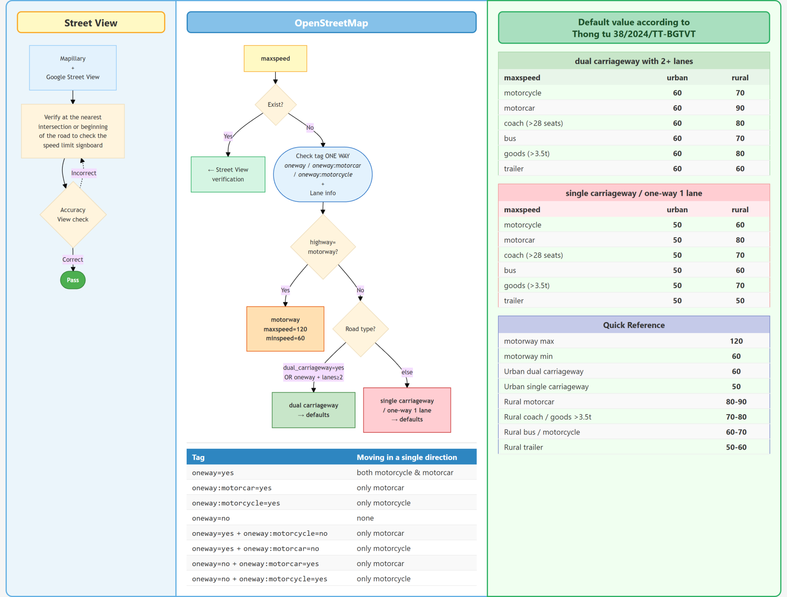

---

## Tài liệu tham khảo

- **Thông tư 38/2024/TT-BGTVT** — Có hiệu lực từ 01/01/2025
- congbao.chinhphu.vn/van-ban/thong-tu-so-38-2024-tt-bgtvt-43378.htm
- vanban.chinhphu.vn/?pageid=27160&docid=211873&classid=1
- OSM wiki: [wiki.openstreetmap.org/wiki/Key:maxspeed](https://wiki.openstreetmap.org/wiki/Key:maxspeed)
- osm-legal-default-speeds: [github.com/westnordost/osm-legal-default-speeds](https://github.com/westnordost/osm-legal-default-speeds) (VN section)
- OSM wiki: [wiki.openstreetmap.org/wiki/Key:dual_carriageway](https://wiki.openstreetmap.org/wiki/Key:dual_carriageway)

---

## Phụ lục hình ảnh

### Nhóm 1: Hình thái đường (Bảng 1.2)

**a. Đường đôi có dải phân cách cứng** — `w32580687` (Phạm Hùng kéo dài)

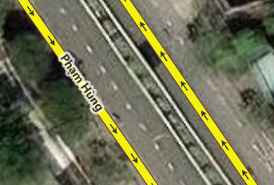

**b. Đường đôi chỉ có vạch sơn ⇒ đường 2 chiều** — `w795077194` (Cầu chữ Y)

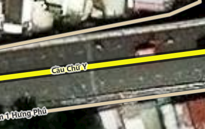

**c. Đường 1 chiều có ≥ 2 làn** — `w326849846` (Đường Pasteur)

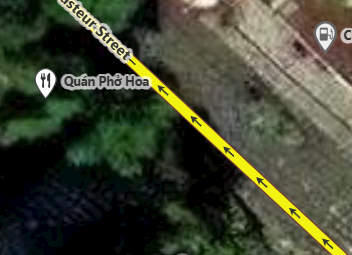

**d. Đường 2 chiều** — `w606251357` (Đường Nguyễn Văn Bá)

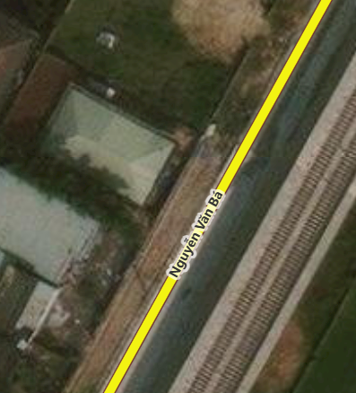

### Nhóm 2 — Urban vs Rural (Bảng 1.3) · `11.337786,106.823004` (Đường tỉnh 471)

**e. Biển báo R.420 "Bắt đầu khu đông dân cư"** · **f. Biển báo R.421 "Hết khu đông dân cư"**

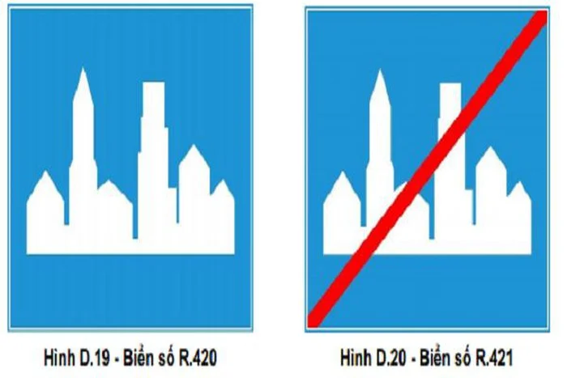

### Nhóm 3 — Xe máy vs Ô tô / Oneway (Bảng 1.5) · `w9656653`

**g. Đường 1 chiều nhưng xe máy đi ngược chiều** = Biển cấm đi ngược chiều + biển phụ "Trừ xe gắn máy" = Biển cấm xe ô tô theo 1 chiều (Phố Mã Mây)

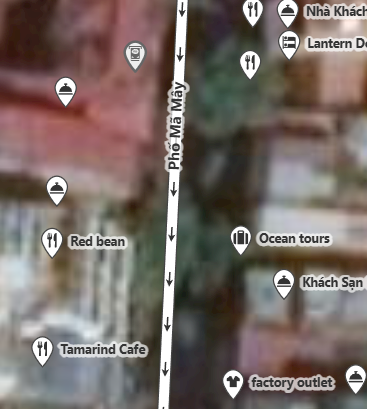

### Nhóm 4 — Biển báo tốc độ (cho Q-2)

**h. Biển báo tốc độ tối đa** (và **i. tối thiểu**)

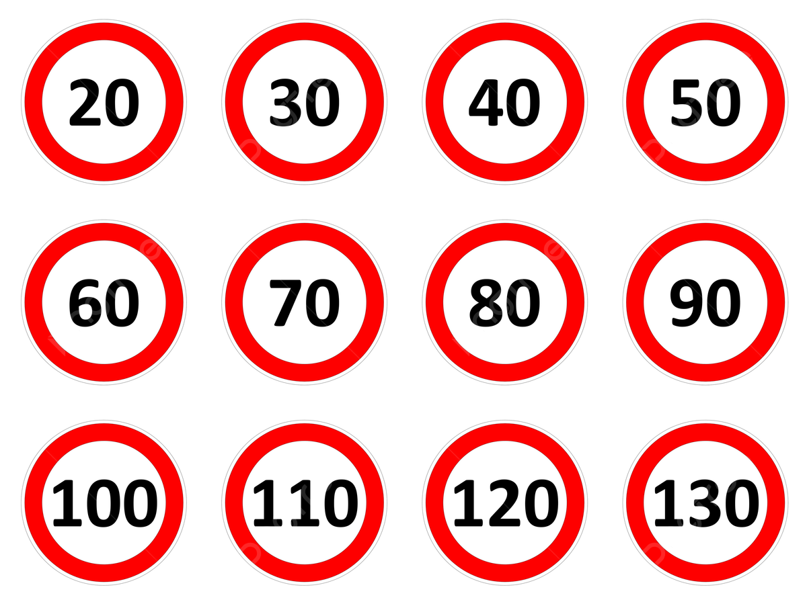

**j. Đoạn đường KHÔNG có biển tốc độ — chỉ có biển tên đường**

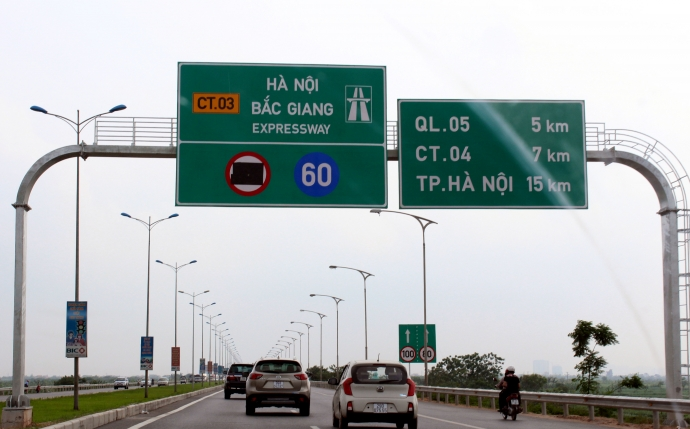

**k. Đoạn đường đầy đủ các tag Tốc độ + Tên đường** (iD Editor)

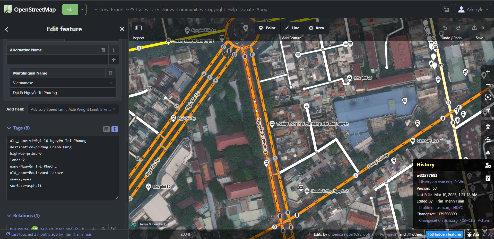

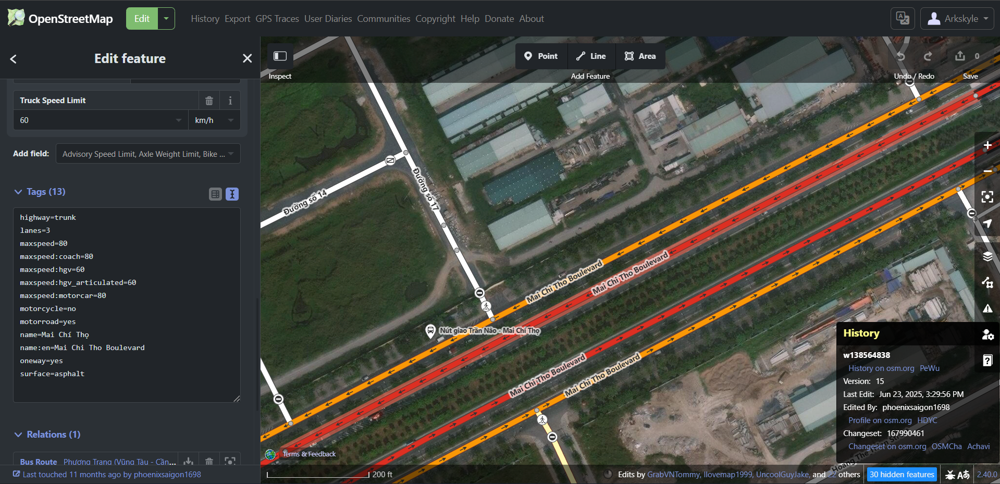

---

> **Nguyên tắc sử dụng:** Tất cả keyword OSM trong báo cáo này đã được đối chiếu với repository **osm-legal-default-speeds** (phần VN) và OSM wiki.
>
> **Input cho Tuệ:** Bảng 2.1 (Decision Matrix) + Bảng 2.3 (Ví dụ) là input chính cho decision tree.

---

*Quay lại → [01 · Bộ Wiki Luật Internal](01-bo-wiki-luat-internal.md)*
